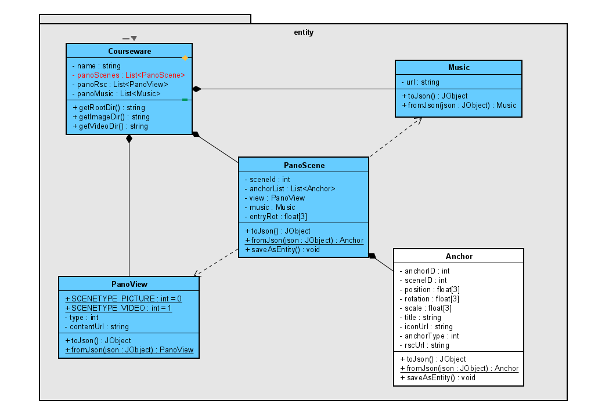

# 【睿】自2023.02.02起的需求清单

## 一.PicoSDK
1. 建立Pico开发环境
    1. outcome：能在Pico上运行一个Unity Demo
2. 基础交互
    1. 描述：在VR场景中制作一个交互Demo
    2. 关键点：
        + 熟悉Pico SDK的手柄开发
        + Unity 射线碰撞检测
		+ outcome：使用Pico手柄完成一个点击物体交互的动作
3. 更多交互（可选）
    + 探索Pico手柄更多的交互功能，例如：扳机，触控盘等
    + outcome：一个VR场景中能平移和跳跃的Avatar。其中平移的速度和方向都可根据手指在手柄触控盘上的位置调整。

## 二、编辑器预览（开始之前需要沟通）
1. PC预览功能
    1. 使用Unity制作一个关卡，使其能预览已经制作完成的课件。能够：
        + 在每个场景中观看全景内容
        + 在每个场景中复现所有的锚点
        + 和每个已经制作好的锚点进行交互
    2. 接口文件：
        + Courseware.cw文件包含预览场景的全部信息
        + Couseware是以Json格式对Courseware对象的序列化。其结构见Entity包类图
        
    3. Outcome：一个包含1.a中功能的Unity工程文件，不需要打包
2. Pico预览功能：
    + 使用PicoSDK中的控制器接口替代鼠标完成的预览关卡。该关卡功能需求与上述完全相同。
    + Outcome：一个在Pico上安装好的预览APK
